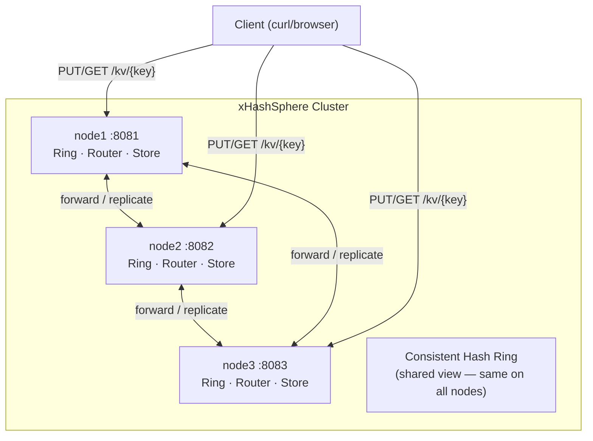
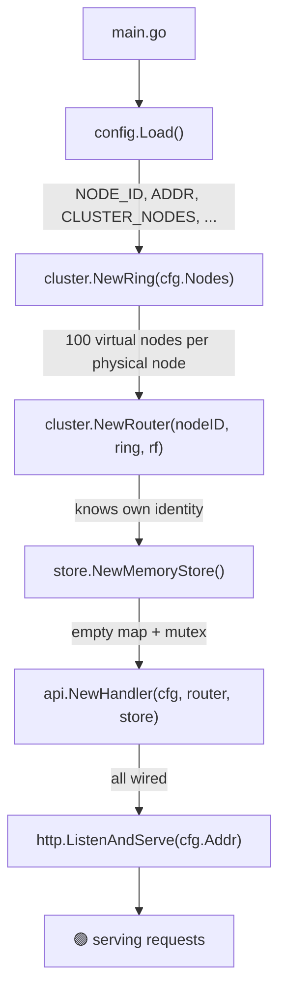
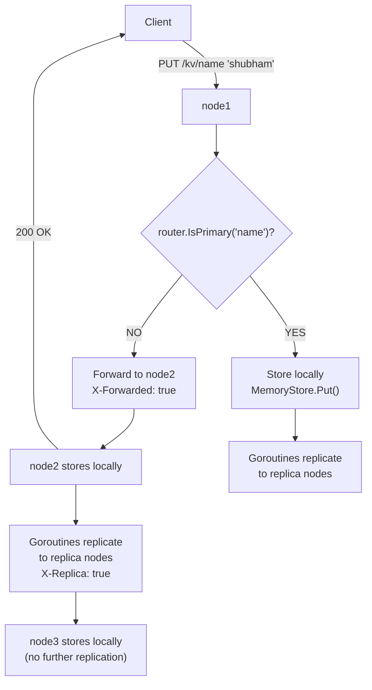
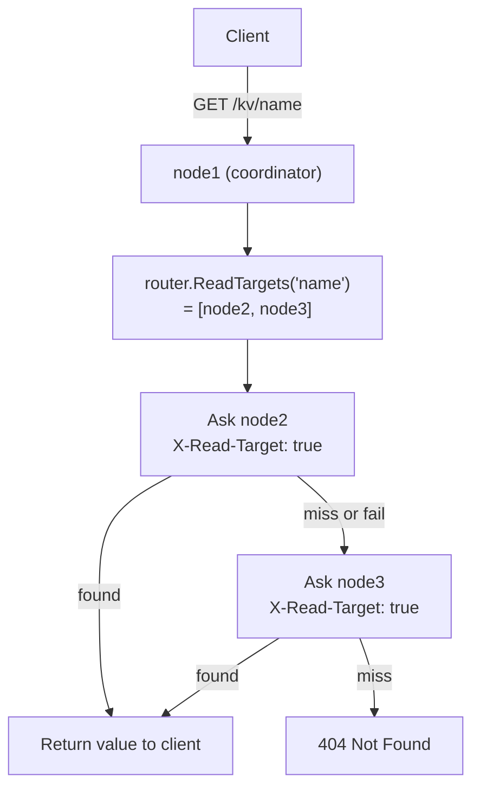
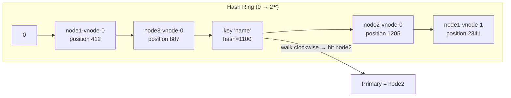
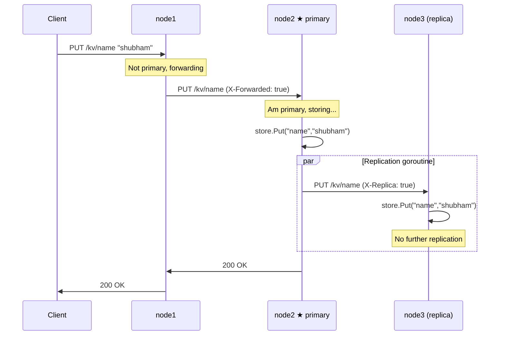
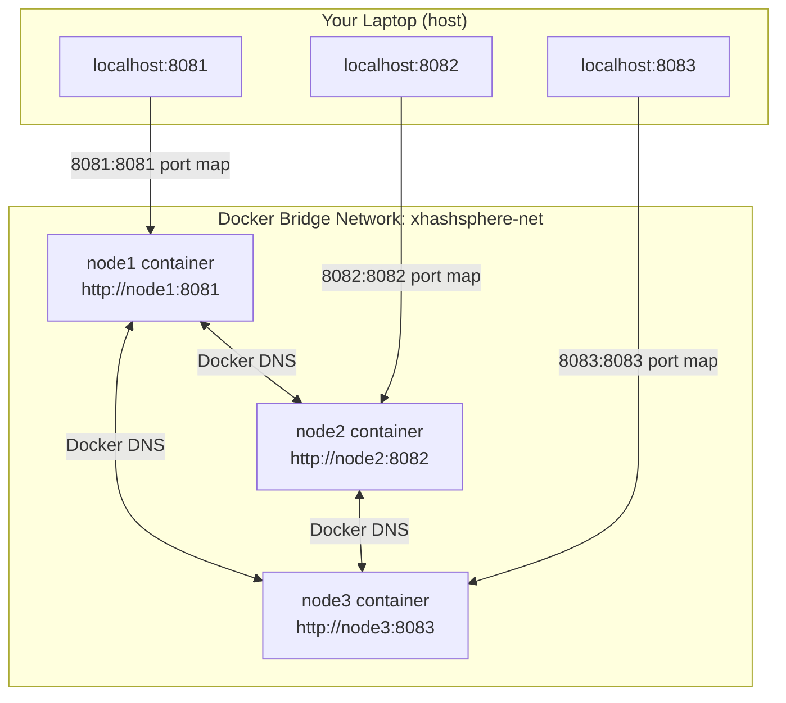

# xHashSphere — Personal Learning Notes

> A beginner-friendly, detailed study guide for the xHashSphere distributed key-value store project in Go.
> repository: https://github.com/Shubhamsavani/xHashSphere

---

## Table of Contents

1. [What Is This Project?](#1-what-is-this-project)
2. [Why Go?](#2-why-go)
3. [Important Go Concepts Used In This Project](#3-important-go-concepts-used-in-this-project)
4. [Project File Structure](#4-project-file-structure)
5. [How The System Works — Big Picture](#5-how-the-system-works--big-picture)
6. [Development Phases — Explained In Detail](#6-development-phases--explained-in-detail)
   - [Phase 1: Project Bootstrap And Config](#phase-1-project-bootstrap-and-config)
   - [Phase 2: Memory Store](#phase-2-memory-store)
   - [Phase 3: Consistent Hash Ring](#phase-3-consistent-hash-ring)
   - [Phase 4: Router](#phase-4-router)
   - [Phase 5: HTTP Server](#phase-5-http-server)
   - [Phase 6: Local KV API](#phase-6-local-kv-api)
   - [Phase 7: Request Forwarding](#phase-7-request-forwarding)
   - [Phase 8: Replication](#phase-8-replication)
   - [Phase 9: Read Fallback](#phase-9-read-fallback)
   - [Phase 10: Docker](#phase-10-docker)
7. [Important Files — Explained Line By Line Conceptually](#7-important-files--explained-line-by-line-conceptually)
8. [Architecture Diagrams (Mermaid)](#8-architecture-diagrams-mermaid)
9. [The Full Example Scenario](#9-the-full-example-scenario)
10. [Tests — What They Prove](#10-tests--what-they-prove)
11. [Environment Variables Reference](#11-environment-variables-reference)
12. [APIs Reference](#12-apis-reference)
13. [Common Questions And Answers](#13-common-questions-and-answers)

---

## 1. What Is This Project?

xHashSphere is a mini distributed key-value store written in Go.

### What is a key-value store?

A key-value store is one of the simplest types of database. Instead of rows and columns like in SQL, it just stores pairs of things:

```
key       → value
----------+---------
name      → shubham
city      → mumbai
language  → go
```

You PUT data in. You GET data out. That is all. Redis is a famous key-value store. xHashSphere is our toy version.

### What does "distributed" mean?

Distributed means the store runs on multiple servers (called nodes) at the same time. In this project we run three nodes on our local machine:

```
node1 → http://localhost:8081
node2 → http://localhost:8082
node3 → http://localhost:8083
```

A client (your curl command, your browser, your app) can send a request to ANY of these three nodes. The cluster figures out where to store or read the data.

### Why would you want multiple nodes?

- **Fault tolerance**: If one node crashes, the others can still serve data.
- **Load distribution**: More servers can handle more requests.
- **Scalability**: You can add more nodes as your data grows.

### What does xHashSphere actually do?

```bash
# Store something
curl -X PUT http://localhost:8081/kv/name -d 'shubham'

# Read it back from ANY node
curl http://localhost:8082/kv/name
# → {"key":"name","value":"shubham","node":"node2"}
```

Even if you PUT on node1, you can GET from node2. The cluster handles routing, storage, and replication for you.

---

## 2. Why Go?

Go was the right choice for this project. Here is why, explained for beginners.

### Go is compiled

Go code compiles to a single binary file. You run `go build` and get one executable. You copy that file to a server and run it. No runtime needed. No dependencies to install. This makes deployment extremely simple — which is why Go is used heavily for backend services and DevOps tools like Docker and Kubernetes.

### Go has simple syntax

Go deliberately has very few keywords and features. There is no class inheritance. No generics complexity (they were added later, kept simple). The language fits in your head. Reading someone else's Go code after six months still makes sense.

### Built-in HTTP server

Go's standard library includes a production-quality HTTP server. You do not need an external web framework. The `net/http` package handles routing, headers, request bodies, timeouts, and concurrency. In xHashSphere we build our entire REST API with just `net/http`.

### Goroutines — lightweight concurrency

A goroutine is like a thread but much cheaper. You can run tens of thousands of goroutines simultaneously without breaking a sweat. In xHashSphere, when node2 replicates data to node3, it starts a goroutine so it doesn't block the main request handling. The syntax is literally just adding `go` in front of a function call:

```go
go func() {
    // this runs concurrently
    replicate(key, value, targetNode)
}()
```

### Channels — safe communication between goroutines

Channels are Go's way of letting goroutines communicate without race conditions. Think of a channel like a pipe: one goroutine puts something in, another takes it out. xHashSphere uses channels to collect replication results from goroutines.

```go
resultCh := make(chan error, len(targets))
for _, target := range targets {
    go func(t Node) {
        resultCh <- sendReplicaRequest(t, key, value)
    }(target)
}
```

### Strong concurrency model

The HTTP server in Go automatically handles each incoming request in its own goroutine. So if 1000 clients hit node1 at the same time, Go runs 1000 goroutines to handle them. This is why we need a mutex on our in-memory map — multiple goroutines could try to read/write it simultaneously.

### One binary deployment

```bash
go build -o xhashsphere ./cmd/xhashsphere
./xhashsphere
```

Done. The binary includes everything. This is why Go is popular for microservices.

---

## 3. Important Go Concepts Used In This Project

### Packages

Go code is organized into packages. A package is a folder of `.go` files that all have the same `package` declaration at the top. Packages group related code together.

```go
package store   // all files in internal/store/ say this

package cluster // all files in internal/cluster/ say this
```

You use other packages with `import`:

```go
import (
    "github.com/Shubhamsavani/xHashSphere/internal/store"
    "github.com/Shubhamsavani/xHashSphere/internal/cluster"
)
```

### The `internal/` Folder

In Go, putting code under a folder named `internal/` makes it private to the module. Code outside the module cannot import it. This is a convention enforced by the Go compiler.

In xHashSphere, `internal/` holds our core logic — store, cluster, config, api. External projects cannot accidentally import and depend on our internals.

### Structs

A struct is a collection of named fields. It is how you define your own data types:

```go
type Node struct {
    ID  string
    URL string
}
```

Now you can create Node values:

```go
n := Node{ID: "node1", URL: "http://localhost:8081"}
fmt.Println(n.ID) // "node1"
```

### Methods

Methods are functions attached to a type. You write `func (receiver Type) MethodName()`:

```go
func (s *MemoryStore) Put(key, value string) {
    s.mu.Lock()
    defer s.mu.Unlock()
    s.data[key] = value
}
```

Here `s` is the receiver — it is like `this` in Java. The `*` means we are using a pointer to the struct (see Pointers below).

### Pointers

A pointer holds the memory address of a value rather than the value itself. When you pass a pointer to a function, the function can modify the original.

```go
func (s *MemoryStore) Put(key, value string) { ... }
```

The `*MemoryStore` means "a pointer to a MemoryStore". Without the `*`, Go would copy the entire struct every time you called a method, and the mutex would not work correctly (you would copy the lock, not use the same lock).

Rule of thumb: if a method needs to modify the struct, or the struct is large, use a pointer receiver.

### Maps

A map is Go's built-in key-value data structure:

```go
m := make(map[string]string)
m["name"] = "shubham"
value := m["name"]  // "shubham"
```

The MemoryStore uses a `map[string]string` to store key-value pairs.

### Mutexes and `sync.RWMutex`

A mutex (mutual exclusion lock) prevents two goroutines from accessing shared data at the same time.

`sync.RWMutex` is a special mutex that allows multiple readers at once, but only one writer at a time. This is perfect for a key-value store: many goroutines can read simultaneously, but writes must be exclusive.

```go
var mu sync.RWMutex

// Writing (exclusive lock)
mu.Lock()
defer mu.Unlock()
data[key] = value

// Reading (shared lock — many readers allowed simultaneously)
mu.RLock()
defer mu.RUnlock()
return data[key]
```

`defer` ensures the unlock happens even if the function panics or returns early.

### Goroutines

Already covered above. Key things to remember:
- Goroutines are cheap — you can start thousands.
- They run concurrently (and in parallel on multi-core machines).
- They do NOT automatically return results — you use channels or callbacks for that.

### Channels

A channel is a typed pipe. You send to it with `<-`:

```go
ch := make(chan string)
ch <- "hello"     // send
msg := <-ch       // receive
```

Buffered channels have capacity and don't block on send until full:

```go
ch := make(chan error, 3)  // buffer of 3
```

### `http.Handler` and `http.ServeMux`

`http.Handler` is an interface — anything implementing `ServeHTTP(w ResponseWriter, r *Request)` is an HTTP handler. `http.ServeMux` is Go's built-in router: you register URL patterns to handler functions.

```go
mux := http.NewServeMux()
mux.HandleFunc("GET /health", h.handleHealth)
mux.HandleFunc("PUT /kv/{key}", h.handleKVPut)
```

### `httptest`

`httptest` is Go's package for testing HTTP handlers without starting a real server. You create a fake request and a fake response recorder:

```go
req := httptest.NewRequest("GET", "/health", nil)
rr  := httptest.NewRecorder()
handler.ServeHTTP(rr, req)
// check rr.Code, rr.Body
```

### JSON Encoding/Decoding

Go's `encoding/json` package converts between Go structs and JSON strings:

```go
// Encode (struct → JSON bytes)
data, _ := json.Marshal(myStruct)

// Decode (JSON bytes → struct)
var myStruct MyType
json.NewDecoder(r.Body).Decode(&myStruct)
```

### Environment Variables

Go reads environment variables with `os.Getenv()`:

```go
nodeID := os.Getenv("NODE_ID")
```

xHashSphere uses a `.env` file loaded by a library (`godotenv`) at startup.

---

## 4. Project File Structure

```
xHashSphere/
│
├── cmd/
│   └── xhashsphere/
│       └── main.go          ← program entry point
│
├── internal/
│   ├── api/
│   │   ├── handler.go       ← HTTP handlers (PUT, GET, health, nodes)
│   │   └── handler_test.go  ← tests for HTTP handlers
│   │
│   ├── cluster/
│   │   ├── node.go          ← Node type definition
│   │   ├── ring.go          ← Consistent hash ring logic
│   │   ├── ring_test.go     ← tests for the ring
│   │   ├── router.go        ← decides primary/replicas from this node's view
│   │   └── router_test.go   ← tests for the router
│   │
│   ├── config/
│   │   └── config.go        ← loads & validates environment configuration
│   │
│   └── store/
│       ├── memory.go        ← in-memory key-value store
│       └── memory_test.go   ← tests for the store
│
├── Dockerfile               ← multi-stage Docker build
├── docker-compose.yml       ← runs 3 nodes together
├── .env                     ← actual env vars (git-ignored)
├── .env.example             ← template showing required vars
├── .dockerignore            ← files to exclude from Docker build
├── .gitignore               ← files to exclude from git
├── go.mod                   ← Go module definition
└── README.md
```

**Why this structure?**

`cmd/` contains the main entry points (executables). `internal/` contains the library code private to this module. This is the standard Go project layout for small to medium projects. Each subfolder of `internal/` has one focused responsibility:

- `config` — knows about environment
- `store` — knows about data storage
- `cluster` — knows about the cluster (nodes, hashing, routing)
- `api` — knows about HTTP (ties config + store + cluster together)

---

## 5. How The System Works — Big Picture

### The Startup Sequence

When you run a node, it goes through these steps:

```
1. main.go starts
2. config.Load()          → read NODE_ID, ADDR, CLUSTER_NODES etc from .env
3. cluster.NewRing()      → build the consistent hash ring from all node URLs
4. cluster.NewRouter()    → wrap the ring with "who am I?" knowledge
5. store.NewMemoryStore() → create an empty map
6. api.NewHandler()       → wire config + router + store into HTTP handlers
7. http.ListenAndServe()  → start accepting requests on ADDR (e.g., :8081)
```

Every node runs this same startup. Every node gets the same ring (same nodes, same hash positions). The only thing different per node is its `NODE_ID` and `ADDR`.

### Request Routing

When a client does `PUT /kv/name`, any node can receive it. The node runs the consistent hash algorithm to find which node is the **primary** for the key `"name"`.

- If **I am the primary** → store locally + replicate
- If **I am NOT the primary** → forward the request to the primary

This forwarding uses a regular HTTP request from node to node. A header `X-XHashSphere-Forwarded: true` prevents infinite forwarding loops.

### Replication

After the primary stores the key, it replicates to one or more replica nodes. With `REPLICATION_FACTOR=2`, two nodes total store the data (primary + one replica). Replication uses goroutines — they run in parallel to speed things up. A header `X-XHashSphere-Replica: true` tells replica nodes "just store this, don't replicate again".

### Read Fallback

When you GET a key, the node receiving the request asks the primary first. If the primary is down or doesn't have it, the node tries replicas in order. This is called read fallback. A header `X-XHashSphere-Read-Target: true` tells target nodes "just check your local store, don't start another chain".

---

## 6. Development Phases — Explained In Detail

### Phase 1: Project Bootstrap And Config

**What was created:** The Go module, folder structure, and configuration loading.

**The Go module** (`go.mod`) declares the module name:

```
module github.com/Shubhamsavani/xHashSphere
```

This is the module path. Every import in the project starts with this path. For example:

```go
import "github.com/Shubhamsavani/xHashSphere/internal/store"
```

**The `cluster.Node` type** is a simple struct:

```go
type Node struct {
    ID  string  // "node1"
    URL string  // "http://localhost:8081"
}
```

This is the basic vocabulary of the cluster — a node has an ID (used for identification) and a URL (used to call it over HTTP).

**The `config.Config` type** holds everything the application needs to know at startup:

```go
type Config struct {
    NodeID            string
    Addr              string
    PublicURL         string
    Nodes             []cluster.Node
    ReplicationFactor int
}
```

**`.env` loading** uses a library (`godotenv`) that reads a `.env` file and sets environment variables before `os.Getenv()` is called. This means local development uses `.env`, and production (Docker) can set real env vars — the code is the same either way.

**Validation** checks that required fields are present and that `REPLICATION_FACTOR` is at least 1 and at most the number of nodes. If someone sets `REPLICATION_FACTOR=5` but only has 3 nodes, the config caps it at 3.

**Parsing `CLUSTER_NODES`**: The format is `node1=http://localhost:8081,node2=http://localhost:8082,node3=http://localhost:8083`. Config splits by comma, then splits each piece by `=` to get `ID` and `URL`.

---

### Phase 2: Memory Store

**What was created:** `internal/store/memory.go`

**The problem it solves:** We need to store key-value pairs in memory and serve them from multiple goroutines safely.

**Why we need a mutex:** Go's HTTP server handles each request in its own goroutine. If ten requests arrive at the same time, ten goroutines run concurrently. If they all try to write to the same map at the same time, we get a data race — unpredictable behavior, corrupted data, or a crash. A `sync.RWMutex` prevents this.

**The MemoryStore struct:**

```go
type MemoryStore struct {
    mu   sync.RWMutex
    data map[string]string
}
```

- `mu` is the lock.
- `data` is the map. It is lowercase (unexported) — code outside the `store` package cannot access it directly. You must use the `Put` and `Get` methods.

**`NewMemoryStore()`** is the constructor:

```go
func NewMemoryStore() *MemoryStore {
    return &MemoryStore{
        data: make(map[string]string),
    }
}
```

It returns a pointer because the mutex must not be copied.

**`Put(key, value string)`:**

```go
func (s *MemoryStore) Put(key, value string) {
    s.mu.Lock()
    defer s.mu.Unlock()
    s.data[key] = value
}
```

`Lock()` acquires exclusive write access. `defer s.mu.Unlock()` ensures the lock is released when the function returns, no matter what.

**`Get(key string) (string, bool)`:**

```go
func (s *MemoryStore) Get(key string) (string, bool) {
    s.mu.RLock()
    defer s.mu.RUnlock()
    val, ok := s.data[key]
    return val, ok
}
```

`RLock()` acquires a shared read lock. Multiple goroutines can hold an `RLock` at the same time — this means reads are fast and do not block each other. The `ok` boolean tells the caller whether the key exists (because an empty string could be a valid value).

---

### Phase 3: Consistent Hash Ring

**What was created:** `internal/cluster/ring.go`

**The problem it solves:** When a client puts a key, which node stores it? We need a deterministic algorithm that:
1. Always gives the same answer for the same key.
2. Distributes keys evenly across nodes.
3. Only reassigns a small number of keys when a node is added or removed (unlike simple modulo hashing).

**What is consistent hashing?**

Imagine a circle (a "ring") numbered from 0 to a very large number (we use 0 to 2³²-1 since we use a 32-bit hash). Every node gets placed at one or more positions on this circle. These positions are determined by hashing the node's ID.

When you want to store a key, you hash the key to get a number. That number lands somewhere on the circle. You walk clockwise from that position until you hit the first node. That node is the primary owner.

**Virtual nodes (vnodes):** If each physical node had only one position, the distribution could be uneven. With 100 virtual nodes per physical node, each physical node gets 100 spots on the ring. Keys spread more evenly. In code, virtual nodes are created by hashing strings like `"node1-vnode-0"`, `"node1-vnode-1"`, ..., `"node1-vnode-99"`.

**FNV hash:** FNV (Fowler-Noll-Vo) is a fast, non-cryptographic hash function. We use it because it is in Go's standard library (`hash/fnv`) and produces a uniform distribution of hash values for strings.

**How the ring is stored:** We keep two data structures:
- A sorted slice of hash positions: `[]uint32`
- A map from position to Node: `map[uint32]Node`

To find the owner of a key, we binary-search the sorted positions for the first one >= the key's hash. This is O(log n) — very fast.

**`NewRing(nodes []Node)`:**

```go
func NewRing(nodes []Node) *Ring {
    r := &Ring{
        positions: make([]uint32, 0),
        posToNode: make(map[uint32]Node),
    }
    for _, node := range nodes {
        for i := 0; i < 100; i++ {
            vnodeKey := fmt.Sprintf("%s-vnode-%d", node.ID, i)
            pos := fnvHash(vnodeKey)
            r.positions = append(r.positions, pos)
            r.posToNode[pos] = node
        }
    }
    sort.Slice(r.positions, func(i, j int) bool {
        return r.positions[i] < r.positions[j]
    })
    return r
}
```

**`PrimaryForKey(key string) (Node, bool)`:** Hashes the key, binary-searches for the first position >= the hash, returns the node there. If we go past the end of the slice, we wrap around to position 0 (the ring is circular).

**`ReplicasForKey(key string, replicationFactor int) []Node`:** Finds the primary, then continues walking clockwise, collecting nodes until we have `replicationFactor` distinct physical nodes.

---

### Phase 4: Router

**What was created:** `internal/cluster/router.go`

**The problem it solves:** The ring can tell you "key X belongs to node2". But the router also knows "I am node1". So the router can answer questions like "Should I handle this request, or forward it?" and "Who should I write to, and who should I replicate to?"

**Ring vs Router — a crucial distinction:**

```
Ring   → knows which node owns a key (globally, from any node's perspective)
Router → knows which node owns a key AND knows who "I" am
```

The ring is pure math. The router adds identity.

**The Router struct:**

```go
type Router struct {
    nodeID            string
    ring              *Ring
    replicationFactor int
}
```

**`PrimaryForKey(key string) (Node, bool)`:** Delegates to the ring.

**`IsPrimary(key string) bool`:** Calls `PrimaryForKey`, checks if the returned node's ID matches `r.nodeID`.

**`WriteTargets(key string) []Node`:** Returns the list of nodes that should store the key. This is `ReplicasForKey(key, replicationFactor)`. The first node in this list is the primary. The rest are replicas.

**`ReadTargets(key string) []Node`:** Same as `WriteTargets` — the same nodes that stored it should be able to serve it. Returns primary first, then replicas in order. The GET handler tries them in this order.

---

### Phase 5: HTTP Server

**What was created:** `internal/api/handler.go` (initial routes), updated `cmd/xhashsphere/main.go`

**The Handler struct:**

```go
type Handler struct {
    cfg        config.Config
    router     *cluster.Router
    store      *store.MemoryStore
    httpClient *http.Client
}
```

This struct wires together all the dependencies:
- `cfg` — for knowing our own node info
- `router` — for key routing decisions
- `store` — for local data access
- `httpClient` — for making outgoing HTTP requests to other nodes

**`NewHandler(cfg, router, store)`** creates a Handler and a shared `http.Client` (with a timeout so we don't wait forever for another node).

**`Routes()` returns an `http.Handler`** with all routes registered on a `http.ServeMux`.

**`GET /health`** returns `200 OK` with `{"status":"ok"}`. Used by Docker, load balancers, and monitoring to check if the node is alive.

**`GET /nodes`** returns the list of all cluster nodes. Useful for debugging — you can see what membership the node knows about.

**`main.go` startup flow:**

```go
cfg, err := config.Load()          // 1. load config
ring := cluster.NewRing(cfg.Nodes) // 2. build hash ring
router := cluster.NewRouter(       // 3. build router
    cfg.NodeID, ring, cfg.ReplicationFactor)
memStore := store.NewMemoryStore() // 4. create store
h := api.NewHandler(cfg, router, memStore) // 5. wire handler
http.ListenAndServe(cfg.Addr, h.Routes())  // 6. serve
```

Each step depends on the previous one. This is called dependency injection — you build dependencies and pass them in, rather than creating them inside the thing that uses them.

---

### Phase 6: Local KV API

**What was created:** `PUT /kv/{key}` and `GET /kv/{key}` handlers.

**Route pattern:** `PUT /kv/{key}` uses Go 1.22's new pattern syntax. The `{key}` captures whatever path segment is there. You retrieve it with `r.PathValue("key")`.

**PUT handler (local, no routing yet):**

```go
func (h *Handler) handleKVPut(w http.ResponseWriter, r *http.Request) {
    key := r.PathValue("key")
    // read body
    body, _ := io.ReadAll(r.Body)
    value := string(body)
    // check if JSON body
    if r.Header.Get("Content-Type") == "application/json" {
        var payload struct{ Value string }
        json.Unmarshal(body, &payload)
        value = payload.Value
    }
    h.store.Put(key, value)
    w.WriteHeader(http.StatusOK)
}
```

It supports two formats: raw body (`-d 'shubham'`) and JSON body (`-d '{"value":"shubham"}'`).

**GET handler (local):**

```go
func (h *Handler) handleKVGetLocal(w http.ResponseWriter, r *http.Request) {
    key := r.PathValue("key")
    val, ok := h.store.Get(key)
    if !ok {
        http.Error(w, "not found", http.StatusNotFound)
        return
    }
    json.NewEncoder(w).Encode(GetResponse{
        Key:   key,
        Value: val,
        Node:  h.cfg.NodeID,
    })
}
```

---

### Phase 7: Request Forwarding

**What was added:** Logic in `handleKVPut` and `handleKVGet` to forward requests to the correct node.

**The forwarding logic:**

```go
if !h.router.IsPrimary(key) {
    primary, _ := h.router.PrimaryForKey(key)
    h.forwardRequest(w, r, primary)
    return
}
// ... handle locally
```

**`forwardRequest(w, r, target Node)`** creates a new HTTP request to the target node's URL, copies the original request body and headers, adds the forwarding header, sends it, and streams the response back to the original client.

**Why the `X-XHashSphere-Forwarded: true` header?**

Without it we could have an infinite loop:

```
client → node1
node1 doesn't know it's primary, forwards to node2
node2 doesn't know it's primary, forwards back to node1
node1 forwards to node2 again...
```

When a node receives a request with `X-XHashSphere-Forwarded: true`, it knows it is already a forwarded request and handles it locally regardless of what the ring says. This prevents loops.

In practice, since the ring is consistent and deterministic, forwarding loops shouldn't happen — but the header is a safety net.

---

### Phase 8: Replication

**What was added:** After storing a key locally, the primary replicates to replica nodes using goroutines.

**How replication works:**

```go
targets := h.router.WriteTargets(key)
// targets[0] is primary, targets[1:] are replicas

// Store locally (we are the primary)
h.store.Put(key, value)

// Replicate to others using goroutines
resultCh := make(chan error, len(targets)-1)
for _, target := range targets[1:] {
    go func(t cluster.Node) {
        resultCh <- h.sendReplicaRequest(t, key, value)
    }(target)
}
```

**`sendReplicaRequest`** is similar to `forwardRequest`, but adds `X-XHashSphere-Replica: true`.

**Why goroutines for replication?**

Without goroutines, if we have 5 replicas and each takes 100ms to respond, the client waits 500ms total. With goroutines, all 5 replications happen in parallel — the client waits ~100ms.

**What does `X-XHashSphere-Replica: true` do?**

When a node receives a PUT with this header, it knows it is receiving a replication, not a new client request. It stores the value locally and does NOT replicate again. Without this, the replica would also replicate, causing an explosion of network requests.

---

### Phase 9: Read Fallback

**What was added:** The GET handler tries multiple nodes in order.

**The read fallback logic:**

```go
targets := h.router.ReadTargets(key)  // [primary, replica1, replica2...]

for _, target := range targets {
    val, found := h.askNodeForKey(target, key)
    if found {
        return val  // return first successful response
    }
}
// all failed
http.Error(w, "not found", http.StatusNotFound)
```

**`askNodeForKey(target, key)`** sends a GET request to the target node with the header `X-XHashSphere-Read-Target: true`. The target node checks its local store only and responds.

**Why the `X-XHashSphere-Read-Target: true` header?**

Without it, if node1 asks node2 for a key, node2 might start its own fallback chain — asking node3, which asks node1, which asks node2... infinite loop.

With the header, node2 knows "just check my local store and respond — don't start your own routing logic".

**Under what conditions does fallback happen?**

- The primary is temporarily down.
- Network issues between the coordinator node and the primary.
- (Theoretically) the primary hasn't stored the key yet — in practice shouldn't happen because we wait for the primary to respond before replicating.

---

### Phase 10: Docker

**What was added:** `Dockerfile`, `docker-compose.yml`, `.dockerignore`

**Multi-stage Dockerfile:**

```dockerfile
# Stage 1: Build
FROM golang:1.26-alpine AS builder
WORKDIR /app
COPY go.mod go.sum ./
RUN go mod download
COPY . .
RUN go build -o xhashsphere ./cmd/xhashsphere

# Stage 2: Run
FROM alpine:3.22
RUN adduser -D appuser
USER appuser
COPY --from=builder /app/xhashsphere /usr/local/bin/
ENTRYPOINT ["xhashsphere"]
```

**Why multi-stage?**

The builder image (`golang:1.26-alpine`) is large — it contains the Go compiler, all tools, header files. We only need the binary to run. The runtime image (`alpine:3.22`) is tiny (~5MB). Multi-stage build copies only the compiled binary into the small image.

**Why `appuser`?**

Running as root inside a container is a security risk. If the container is compromised, the attacker has root. `appuser` is a non-privileged user — limits damage.

**Docker Compose:**

```yaml
services:
  node1:
    build: .
    ports:
      - "8081:8081"
    environment:
      NODE_ID: node1
      ADDR: :8081
      PUBLIC_URL: http://node1:8081
      CLUSTER_NODES: node1=http://node1:8081,node2=http://node2:8082,node3=http://node3:8083
      REPLICATION_FACTOR: 2
    networks:
      - xhashsphere-net

  # node2 and node3 similar...

networks:
  xhashsphere-net:
    driver: bridge
```

**Two different addresses for the same node:**

From your laptop: `http://localhost:8081` — Docker maps host port 8081 to the container's port 8081.

Inside Docker network: `http://node1:8081` — Docker's built-in DNS resolves the service name `node1` to the container's IP automatically.

This is why `PUBLIC_URL` is `http://node1:8081` (used for inter-node communication) even though from outside you use `http://localhost:8081`.

**`.dockerignore`** prevents the Docker build from including unnecessary files:

```
.git
.env
*.md
*_test.go
```

We don't want git history, secrets (`.env`), docs, or test files inside the Docker image.

---

## 7. Important Files — Explained Line By Line Conceptually

### `cmd/xhashsphere/main.go`

**Why it exists:** Every Go program needs exactly one `main` package with a `main()` function. This is the entry point.

**What it does:**
1. Loads the `.env` file (using `godotenv.Load()`).
2. Calls `config.Load()` to parse all env vars into a `Config` struct.
3. Calls `cluster.NewRing(cfg.Nodes)` to build the consistent hash ring.
4. Calls `cluster.NewRouter(cfg.NodeID, ring, cfg.ReplicationFactor)` to create the routing logic.
5. Calls `store.NewMemoryStore()` to create the in-memory store.
6. Calls `api.NewHandler(cfg, router, store)` to create the HTTP handler.
7. Calls `http.ListenAndServe(cfg.Addr, handler.Routes())` to start serving.

If any step fails (e.g., `config.Load()` finds missing required env vars), the program logs the error and calls `os.Exit(1)` — it does not start a broken server.

**Connections:** Uses `config`, `cluster`, `store`, `api` packages. It is the only file that imports all of them together.

---

### `internal/config/config.go`

**Why it exists:** One place to define what configuration the application needs and how to load it. No other file scatters `os.Getenv()` calls.

**What it does:**

- Defines the `Config` struct.
- `Load()` reads all environment variables, validates them, and returns a `Config`.
- Parses `CLUSTER_NODES` string into `[]cluster.Node`.
- Applies defaults (e.g., if `REPLICATION_FACTOR` is empty, defaults to 1).
- Caps `REPLICATION_FACTOR` at `len(cfg.Nodes)` — you can't replicate to more nodes than exist.

**How it connects:** `main.go` calls it first. The resulting `Config` is passed to almost everything else.

---

### `internal/cluster/node.go`

**Why it exists:** Separates the `Node` type definition from the ring and router logic.

**What it does:** Defines:

```go
type Node struct {
    ID  string
    URL string
}
```

That's it. Simple and focused.

---

### `internal/cluster/ring.go`

**Why it exists:** Implements consistent hashing — the core algorithm that makes the system distributed.

**What it does:**

- `Ring` struct: holds sorted positions and a position-to-node map.
- `NewRing(nodes []Node)` builds the ring from all cluster nodes.
- `fnvHash(s string) uint32` computes an FNV-1a hash of a string.
- `PrimaryForKey(key string) (Node, bool)` finds the primary node for a key using binary search on the sorted positions.
- `ReplicasForKey(key string, n int) []Node` returns n distinct physical nodes starting from the primary, walking clockwise.

**Key implementation detail — wrap-around:** The ring is circular. If a key's hash is larger than all positions, we wrap to position 0 (the smallest position). This is implemented by checking `idx >= len(r.positions)` and resetting to 0.

**Key implementation detail — distinct physical nodes:** When collecting replicas, we must skip virtual nodes that belong to a physical node we've already included. The ring might have 100 virtual nodes for node1, and we don't want to list node1 as both primary and replica.

---

### `internal/cluster/router.go`

**Why it exists:** The ring is stateless math. The router adds state: "I am node1." This lets handler code ask clean questions like `IsPrimary(key)` instead of doing the comparison themselves.

**What it does:**

- `Router` struct holds `nodeID`, `ring`, and `replicationFactor`.
- `NewRouter(nodeID, ring, rf)` creates a router.
- `IsPrimary(key string) bool` checks if this node is the primary.
- `PrimaryForKey(key string) (Node, bool)` delegates to ring.
- `WriteTargets(key string) []Node` returns the ordered list of nodes to write to.
- `ReadTargets(key string) []Node` same as WriteTargets (same nodes, same order).

**How it connects:** The handler (`api/handler.go`) uses the router for all routing decisions. The handler never calls the ring directly.

---

### `internal/store/memory.go`

**Why it exists:** The storage engine. Completely separate from HTTP concerns.

**What it does:**

- `MemoryStore` struct with a `sync.RWMutex` and a `map[string]string`.
- `NewMemoryStore()` constructor returns a pointer.
- `Put(key, value string)` acquires a write lock, stores, unlocks.
- `Get(key string) (string, bool)` acquires a read lock, retrieves, unlocks.

**How it connects:** `main.go` creates one `MemoryStore` and passes it to the handler. The handler calls `store.Put()` and `store.Get()` directly. Replica request handlers also call `store.Put()`.

---

### `internal/api/handler.go`

**Why it exists:** HTTP is the interface to the outside world. This file translates between HTTP requests/responses and the business logic in `cluster` and `store`.

**What it does:**

- `Handler` struct with cfg, router, store, httpClient.
- `NewHandler(cfg, router, store) *Handler` constructor.
- `Routes() http.Handler` registers all routes on a ServeMux and returns it.
- `handleHealth` — responds with `{"status":"ok"}`.
- `handleNodes` — responds with JSON array of all cluster nodes.
- `handleKV` — dispatches to `handleKVPut` or `handleKVGetCoordinator`.
- `handleKVPut` — checks forwarding header → if forwarded/replica, store directly. Otherwise check if primary, forward if not, or store + replicate if yes.
- `handleKVGetCoordinator` — checks read-target header → if read-target, do local lookup only. Otherwise get read targets and try them in order.
- `forwardRequest` — clones the incoming request to another node.
- `sendReplicaRequest` — sends a PUT with X-Replica header.
- `askNodeForKey` — sends a GET with X-Read-Target header.

**How it connects:** Uses `cluster.Router` for routing decisions, `store.MemoryStore` for local storage, `http.Client` for inter-node communication, `config.Config` for node identity.

---

### `Dockerfile`

**Why it exists:** Describes how to build a Docker image for one node.

**What it does:**

```dockerfile
FROM golang:1.26-alpine AS builder   # build stage
WORKDIR /app
COPY go.mod go.sum ./
RUN go mod download                  # download deps (layer cached)
COPY . .
RUN CGO_ENABLED=0 go build \        # compile to static binary
    -o xhashsphere ./cmd/xhashsphere

FROM alpine:3.22                     # runtime stage (tiny)
RUN addgroup -S app && adduser -S appuser -G app
USER appuser
COPY --from=builder /app/xhashsphere /usr/local/bin/xhashsphere
ENTRYPOINT ["xhashsphere"]
```

`CGO_ENABLED=0` produces a fully static binary — no shared library dependencies. This is important on Alpine which uses `musl` instead of `glibc`.

**How it connects:** `docker-compose.yml` uses this Dockerfile with `build: .` to build the image.

---

### `docker-compose.yml`

**Why it exists:** Starts all three nodes together with correct environment variables and networking.

**Key concepts:**

`networks:` creates a Docker bridge network. All services in the network can call each other by service name.

`environment:` sets the env vars without needing a `.env` file inside the container (the container's env vars are its configuration).

`ports: "8081:8081"` maps host port 8081 to container port 8081. Without this, you could not access the container from your laptop.

`depends_on:` is not used here because all nodes are peers — none depends on another.

---

### `.env.example`

**Why it exists:** Documents what env vars are required. The actual `.env` is git-ignored (never commit secrets). `.env.example` is committed and shows what needs to be configured.

```env
NODE_ID=node1
ADDR=:8081
PUBLIC_URL=http://localhost:8081
CLUSTER_NODES=node1=http://localhost:8081,node2=http://localhost:8082,node3=http://localhost:8083
REPLICATION_FACTOR=2
```

---

### `.dockerignore`

**Why it exists:** Docker sends all files in the build context to the Docker daemon. `.dockerignore` excludes files we don't need in the image.

```
.git
.env
*.md
*_test.go
tmp/
```

Without this, Git history, your local secrets (`.env`), and test files would be sent to Docker — wasting time and potentially exposing secrets.

---

### `.gitignore`

**Why it exists:** Prevents certain files from being tracked by Git.

```
.env          # secrets — never commit
*.exe         # Windows binaries
xhashsphere   # compiled binary
tmp/
```

---

## 8. Architecture Diagrams (Mermaid)

### Diagram 1: Overall Architecture



**Plain English:** A client can talk to any node. All three nodes share the same ring logic — they independently compute the same ownership answers. Nodes talk to each other for forwarding and replication.

---

### Diagram 2: Startup Flow



**Plain English:** Dependencies are built in order. Each step uses the output of the previous one. The HTTP server only starts after everything is ready.

---

### Diagram 3: PUT Request Flow



**Plain English:** Node1 checks if it owns the key. If not, it forwards. If yes, it stores and replicates. Replication goes in parallel goroutines. Only the primary replicates — replicas don't replicate further.

---

### Diagram 4: GET Request Flow With Fallback



**Plain English:** The coordinator tries the primary first, then replicas in order. The X-Read-Target header prevents the target node from starting another round of routing. First successful response wins.

---

### Diagram 5: Consistent Hash Ring



**Plain English:** The key `"name"` hashes to position 1100 on the ring. Walking clockwise, the first virtual node hit belongs to node2. So node2 is the primary. Numbers here are illustrative — real positions are much larger (up to 2³²).

---

### Diagram 6: Replication Flow



**Plain English:** The replication to node3 happens in parallel (using a goroutine) while node2 is still waiting. node3 stores and stops — the X-Replica header tells it not to replicate further. The client gets 200 OK after node2 confirms storage.

---

### Diagram 7: Docker Compose Network



**Plain English:** Containers see each other using service names (Docker DNS). Your laptop sees the containers through port mappings. The `PUBLIC_URL` environment variable is set to `http://node1:8081` so nodes use service names internally, not localhost.

---

## 9. The Full Example Scenario

Let us trace exactly what happens when we run the example scenario.

**Cluster configuration:**
```
node1 → http://localhost:8081
node2 → http://localhost:8082
node3 → http://localhost:8083
REPLICATION_FACTOR=2
```

**Assume the consistent hash ring assigns:**
```
key "name" → primary = node2
           → replica  = node3
```

---

### PUT: Storing the value

```bash
curl -X PUT http://localhost:8081/kv/name -d 'shubham'
```

**Step-by-step:**

1. HTTP request arrives at **node1**'s handler.
2. `handleKVPut()` is called with key=`"name"`, value=`"shubham"`.
3. Check forwarded header: `X-XHashSphere-Forwarded` is not set → this is a fresh request.
4. `router.IsPrimary("name")` → node1 calls `ring.PrimaryForKey("name")` → returns node2. node1's ID is `"node1"` ≠ `"node2"`. Returns `false`.
5. node1 calls `router.PrimaryForKey("name")` → gets node2's URL: `http://node2:8082`.
6. node1 makes a new HTTP request: `PUT http://node2:8082/kv/name` with body `"shubham"` and header `X-XHashSphere-Forwarded: true`.

7. **node2** receives the forwarded request.
8. `handleKVPut()` is called again.
9. Check forwarded header: `X-XHashSphere-Forwarded: true` is set → skip ownership check, handle locally.
10. `router.WriteTargets("name")` → returns `[node2, node3]` (node2 is primary, node3 is replica).
11. `store.Put("name", "shubham")` → node2's local map now has `"name"→"shubham"`.
12. Start goroutine to replicate to node3:
    - `PUT http://node3:8083/kv/name` with body `"shubham"` and header `X-XHashSphere-Replica: true`.
13. node2 responds `200 OK` to node1.
14. node1 streams that `200 OK` back to the original client.

15. **node3** receives the replica request (concurrently, in a goroutine).
16. `handleKVPut()` is called.
17. Check replica header: `X-XHashSphere-Replica: true` is set → skip replication, just store.
18. `store.Put("name", "shubham")` → node3's local map now has `"name"→"shubham"`.
19. node3 responds `200 OK` to the goroutine (goroutine logs or ignores result).

**Final state of each node's store:**
```
node1: {}                        ← no copy (just forwarded)
node2: {"name": "shubham"}      ← primary copy
node3: {"name": "shubham"}      ← replica copy
```

---

### GET: Reading the value

```bash
curl http://localhost:8081/kv/name
```

**Step-by-step:**

1. HTTP request arrives at **node1**.
2. `handleKVGetCoordinator()` is called with key=`"name"`.
3. Check read-target header: not set → this is a coordinator request.
4. `router.ReadTargets("name")` → returns `[node2, node3]`.
5. Try **node2** first:
   - `GET http://node2:8082/kv/name` with header `X-XHashSphere-Read-Target: true`.
   - node2 receives this request.
   - Read-target header is set → check local store only, no forwarding.
   - `store.Get("name")` → returns `"shubham"`, `true`.
   - node2 responds with `{"key":"name","value":"shubham","node":"node2"}`.
6. node1 receives the response from node2, found!
7. node1 returns `{"key":"name","value":"shubham","node":"node2"}` to the client.

**If node2 was down:**

5b. `GET http://node2:8082/kv/name` → connection refused, error.
6b. Try **node3**: `GET http://node3:8083/kv/name` with X-Read-Target header.
7b. node3 checks local store → has `"shubham"`.
8b. node3 responds with `{"key":"name","value":"shubham","node":"node3"}`.
9b. node1 returns that to the client.

**If both node2 and node3 were down:**

node1 exhausts all read targets → responds `404 Not Found`.

---

## 10. Tests — What They Prove

### `internal/store/memory_test.go`

Tests for the in-memory store. What they prove:

- **Put and Get basic functionality:** Put a key, Get it back, verify the value matches.
- **Get non-existent key:** Returns `""` and `false`. Confirms the `bool` return value works correctly.
- **Concurrent access safety:** Starts many goroutines doing simultaneous Puts and Gets. If there were a race condition, the Go race detector (`go test -race`) would catch it. A passing test proves the mutex works.
- **Overwrite:** Put the same key twice, verify the second value wins.

### `internal/cluster/ring_test.go`

Tests for the consistent hash ring. What they prove:

- **Determinism:** The same key always returns the same node. Hash functions must be deterministic.
- **All keys are assigned:** No key should return "no node found" when the ring has nodes.
- **Even-ish distribution:** With 100 virtual nodes, the key space should be distributed roughly evenly. Test distributes many keys and checks no single node gets an absurdly high or low percentage.
- **Replica selection:** `ReplicasForKey` returns exactly `replicationFactor` distinct physical nodes.
- **Replica list starts with primary:** The first element of the replica list is the primary.
- **No duplicate nodes in replica list:** Even though each node has 100 virtual positions, we should never get `[node2, node2]` — only distinct physical nodes.

### `internal/cluster/router_test.go`

Tests for the router. What they prove:

- **`IsPrimary` returns true when it should:** If the ring says node2 is primary for key X, and the router was created with nodeID="node2", `IsPrimary("X")` must return true.
- **`IsPrimary` returns false when it should:** Same key, router created with nodeID="node1", must return false.
- **`WriteTargets` length equals replication factor:** With RF=2, we get exactly 2 nodes.
- **`ReadTargets` equals `WriteTargets`:** Same nodes, same order.

### `internal/api/handler_test.go`

Tests for the HTTP layer. What they prove:

- **`GET /health` returns 200:** The health endpoint always works.
- **`GET /nodes` returns all cluster nodes as JSON:** Parses the response and verifies node IDs and URLs are present.
- **`PUT /kv/{key}` stores and `GET /kv/{key}` retrieves:** In a single-node test setup where the handler IS the primary, PUT stores and GET retrieves.
- **`GET /kv/{key}` returns 404 for missing key:** Confirms the handler returns the right status code.
- **JSON body PUT works:** Sending `{"value":"foo"}` with Content-Type application/json stores `"foo"` correctly.
- **Raw body PUT works:** Sending `shubham` as raw body stores `"shubham"` correctly.
- **Forwarded requests are handled locally:** If X-XHashSphere-Forwarded is set, the handler stores regardless of ring ownership (test verifies this by using a key that would normally be forwarded).
- **Replica requests are stored without further replication:** If X-XHashSphere-Replica is set, handler stores and does not call out to other nodes.
- **Read-target requests return local-only results:** If X-XHashSphere-Read-Target is set and the key is not in local store, returns 404 (does not do read fallback).

Tests use `httptest.NewRequest` and `httptest.NewRecorder` to simulate HTTP without starting a real server.

---

## 11. Environment Variables Reference

| Variable | Example | Required | Description |
|---|---|---|---|
| `NODE_ID` | `node1` | Yes | Unique name for this node. Used by router to know "who am I". |
| `ADDR` | `:8081` | Yes | Address and port this node listens on. |
| `PUBLIC_URL` | `http://localhost:8081` | Yes | URL other nodes use to reach this node. In Docker: use service name. |
| `CLUSTER_NODES` | `node1=http://localhost:8081,...` | Yes | Comma-separated list of all cluster members. Same on all nodes. |
| `REPLICATION_FACTOR` | `2` | No (default: 1) | Number of nodes that store each key. Capped at cluster size. |

---

## 12. APIs Reference

### `GET /health`

Returns `200 OK` with `{"status":"ok"}`.

Used for health checks. Always responds if the node is running.

### `GET /nodes`

Returns `200 OK` with JSON array:

```json
[
  {"id": "node1", "url": "http://localhost:8081"},
  {"id": "node2", "url": "http://localhost:8082"},
  {"id": "node3", "url": "http://localhost:8083"}
]
```

### `PUT /kv/{key}`

Stores a value for the key. Supports two formats:

**Raw body:**
```bash
curl -X PUT http://localhost:8081/kv/name -d 'shubham'
```

**JSON body:**
```bash
curl -X PUT http://localhost:8081/kv/name \
  -H 'Content-Type: application/json' \
  -d '{"value":"shubham"}'
```

Returns `200 OK` on success.

### `GET /kv/{key}`

Retrieves a value. Returns:

```json
{
  "key": "name",
  "value": "shubham",
  "node": "node2"
}
```

The `node` field tells you which node in the cluster actually served the data.

Returns `404 Not Found` if the key does not exist in any reachable node.

---

## 13. Common Questions And Answers

**Q: Why can't node1 store the key directly when it receives the PUT? Why forward?**

A: We need consistent storage. If any node could store any key, the same key might end up on different nodes depending on which node the client happens to hit. Then GET requests would fail because the "right" node doesn't have the data. By always routing to the same primary based on the hash, we guarantee the data is always in a predictable place.

**Q: What happens if the primary (node2) crashes after storing but before replicating?**

A: The data is lost. This is a limitation of this simple implementation. Production systems use techniques like write-ahead logs, two-phase commit, or Raft consensus to handle this. For a learning project, fire-and-forget replication is fine.

**Q: Why 100 virtual nodes per physical node?**

A: With fewer virtual nodes, key distribution becomes uneven. With 1 vnode per node, one node might end up owning 60% of the key space. With 100 vnodes, the randomness of hashing evens out the distribution. 100 is a common default in implementations like Apache Cassandra. Higher numbers give better distribution but use more memory for the ring data structure.

**Q: Can I add a new node while the system is running?**

A: Not in this implementation. The node list is loaded at startup from `CLUSTER_NODES`. Adding a node would require restarting all nodes with the new list and re-distributing data (rehashing). Production systems handle this with gossip protocols and automatic rebalancing.

**Q: What if two nodes both think they are the primary for the same key?**

A: This cannot happen with consistent hashing. All nodes run the same deterministic algorithm on the same node list. Given the same key and the same node list, they all compute the same primary. There is no voting or coordination needed — the hash function is the authority.

**Q: Why use FNV hash specifically?**

A: FNV is fast, has good distribution, and is in Go's standard library. For a key-value store, we don't need cryptographic security (SHA, MD5) — we just need a fast function that spreads values uniformly across the hash space. FNV is perfect for this.

**Q: What is the purpose of `defer mu.Unlock()`?**

A: `defer` schedules a function call to run when the surrounding function returns. By writing `defer mu.Unlock()` immediately after `mu.Lock()`, we guarantee the lock is always released — even if the function panics or returns early via multiple `return` statements. Without `defer`, you might forget to unlock in one of several return paths and cause a deadlock.

**Q: Why does the `Handler` use a shared `http.Client` instead of creating a new one per request?**

A: Creating an `http.Client` is cheap, but the client manages a pool of TCP connections to remote servers (connection pooling). Reusing one client allows it to reuse existing TCP connections to node2 and node3, which is much faster than establishing a new TCP handshake for every forwarded request.

**Q: The GET response says `"node": "node2"` — what does that mean?**

A: It tells the client which node in the cluster actually served the data. This is useful for debugging (is node2 serving what it should?) and for observability (track which node handles the most reads). Even if you asked node1, if node2 actually had the data, the response says node2.

---

*End of PERSONAL_NOTES.md — xHashSphere by Shubham Savani*
